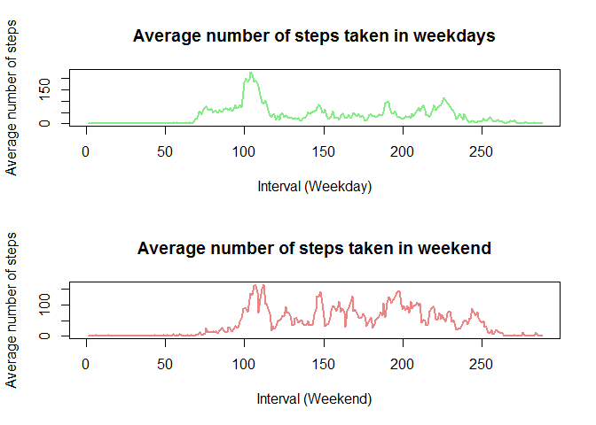

## Loading and preprocessing the data

Downloading, reading, processing data


```r
temp <- tempfile()
download.file("https://d396qusza40orc.cloudfront.net/repdata%2Fdata%2Factivity.zip",temp)
mydata <- read_csv(unzip(temp, "activity.csv"), na = c("NA",NA), col_names = TRUE  )
```

```
## Parsed with column specification:
## cols(
##   steps = col_double(),
##   date = col_date(format = ""),
##   interval = col_double()
## )
```

```r
unlink(temp)
mydata <- tbl_df(mydata)
```

```
## Warning: `tbl_df()` is deprecated as of dplyr 1.0.0.
## Please use `tibble::as_tibble()` instead.
## This warning is displayed once every 8 hours.
## Call `lifecycle::last_warnings()` to see where this warning was generated.
```

```r
head(mydata)
```

```
## # A tibble: 6 x 3
##   steps date       interval
##   <dbl> <date>        <dbl>
## 1    NA 2012-10-01        0
## 2    NA 2012-10-01        5
## 3    NA 2012-10-01       10
## 4    NA 2012-10-01       15
## 5    NA 2012-10-01       20
## 6    NA 2012-10-01       25
```


## What is mean total number of steps taken per day?


Histogram of total number of steps taken each day.


```r
steps_per_day = aggregate(steps ~ date, data = mydata, sum, na.rm = TRUE)
ggplot(data = steps_per_day, aes(x= steps)) + geom_histogram(fill="red", colour = "white") + theme_bw()
```

```
## `stat_bin()` using `bins = 30`. Pick better value with `binwidth`.
```

<!-- -->


Mean and median number of steps for each day


```r
summary(steps_per_day$steps )
```

```
##    Min. 1st Qu.  Median    Mean 3rd Qu.    Max. 
##      41    8841   10765   10766   13294   21194
```


## What is the average daily activity pattern?

Time series plot


```r
avg_per_day <-aggregate(steps ~ date, data = mydata, mean, na.rm = TRUE)
with(data = avg_per_day, 
        plot( steps, type='l', 
             xlab='Date',
             lwd=2, 
             ylab='Average number of steps',
             main ='Average number of steps taken each day', col=rgb(0.2,0.4,0.6,0.8)
     ))
```

<!-- -->


The 5-minute interval that, on average, contains the maximum number of steps:


```r
avg_per_interval <-aggregate(steps ~ interval, data = mydata, mean, na.rm = TRUE)
which.max(avg_per_interval$steps)
```

```
## [1] 104
```

```r
as_hms(104*5*60)
```

```
## 08:40:00
```

The 5-minute interval that, on average, contains the maximum number of steps is the 104 i.e between 8:35 and 8:40

## Imputing missing values

The total number of missing values in the dataset


```r
NA_row <- sum(is.na(mydata))
NA_row
```

```
## [1] 2304
```
The strategy is to fill in a missing value with the average number of steps in the same 5-min interval.
We will create a new dataset as the original and use tapply for the filling in.


```r
mydata02 <- mydata
na_row <- is.na(mydata02$steps)
avg_interval <- tapply(mydata02$steps, mydata02$interval, mean, na.rm=TRUE, simplify=TRUE)
mydata02$steps[na_row] <- avg_interval[as.character(mydata02$interval[na_row])]
```


Verifying the result:

```r
sum(is.na(mydata))
```

```
## [1] 2304
```

```r
sum(is.na(mydata02))
```

```
## [1] 0
```

Histogram of the filled dataset (without NA)


```r
head(mydata02)
```

```
## # A tibble: 6 x 3
##    steps date       interval
##    <dbl> <date>        <dbl>
## 1 1.72   2012-10-01        0
## 2 0.340  2012-10-01        5
## 3 0.132  2012-10-01       10
## 4 0.151  2012-10-01       15
## 5 0.0755 2012-10-01       20
## 6 2.09   2012-10-01       25
```

```r
steps_per_day02 = aggregate(steps ~ date, data = mydata02, sum, na.rm = TRUE)
ggplot(data = steps_per_day02, aes(x= steps)) + geom_histogram(fill="red", colour = "white") + theme_bw()
```

```
## `stat_bin()` using `bins = 30`. Pick better value with `binwidth`.
```

<!-- -->


Mean and median number of steps taken each day of the filled dataset (without NA)


```r
summary(steps_per_day02$steps )
```

```
##    Min. 1st Qu.  Median    Mean 3rd Qu.    Max. 
##      41    9819   10766   10766   12811   21194
```

Time series plot of the average number of steps taken of the filled dataset (without NA)

```r
avg_per_interval02 <-aggregate(steps ~ interval, data = mydata02, sum, na.rm = TRUE)
with(data = avg_per_interval02 , 
     plot( steps, col="red", type='l', 
          xlab='Intervals',
          lwd=2, 
          ylab='Average number of steps',
          main ='Average number of steps taken in 5-minute interval'
           ))
```

<!-- -->

## Are there differences in activity patterns between weekdays and weekends?


To determine a difference in activity patterns between weekdays and weekends, we will create a new factor "type_of_day" ("weekend" & "weekday") and and plotting the average of steps by interval for weekdays and weekend

```r
mydata02 <- mutate(mydata02, type_of_day = ifelse(weekdays(mydata02$date) == "Saturday" | weekdays(mydata02$date) == "Sunday", "weekend", "weekday"))
mydata02$type_of_day <- as.factor(mydata02$type_of_day)
head(mydata02)
```

```
## # A tibble: 6 x 4
##    steps date       interval type_of_day
##    <dbl> <date>        <dbl> <fct>      
## 1 1.72   2012-10-01        0 weekday    
## 2 0.340  2012-10-01        5 weekday    
## 3 0.132  2012-10-01       10 weekday    
## 4 0.151  2012-10-01       15 weekday    
## 5 0.0755 2012-10-01       20 weekday    
## 6 2.09   2012-10-01       25 weekday
```

```r
weekday_act <- filter(mydata02,type_of_day == "weekday" )
weekend_act <- filter(mydata02,type_of_day == "weekend" )
avg_per_weekday <-aggregate(steps ~ interval, data = weekday_act, mean, na.rm = TRUE)
avg_per_weekend <-aggregate(steps ~ interval, data = weekend_act, mean, na.rm = TRUE)
par(mfrow = c(2,1))
with(data = avg_per_weekday, plot(steps, type='l', 
          xlab='Interval (Weekday)',
          lwd=2, 
          ylab='Average number of steps',
          main ='Average number of steps taken in weekdays',
          col=rgb(0.4,0.9,0.4,0.8)))
with(data = avg_per_weekend, plot(steps, type='l',
          xlab='Interval (Weekend)',
          lwd=2, 
          ylab='Average number of steps',
          main ='Average number of steps taken in weekend', 
          col=rgb(0.9,0.4,0.4,0.8)))
```

<!-- -->

The graphs display clear differences in patterns between
